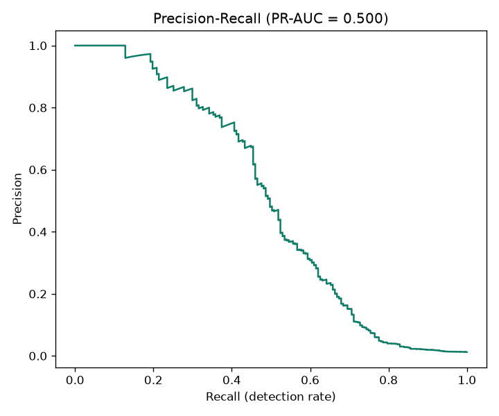
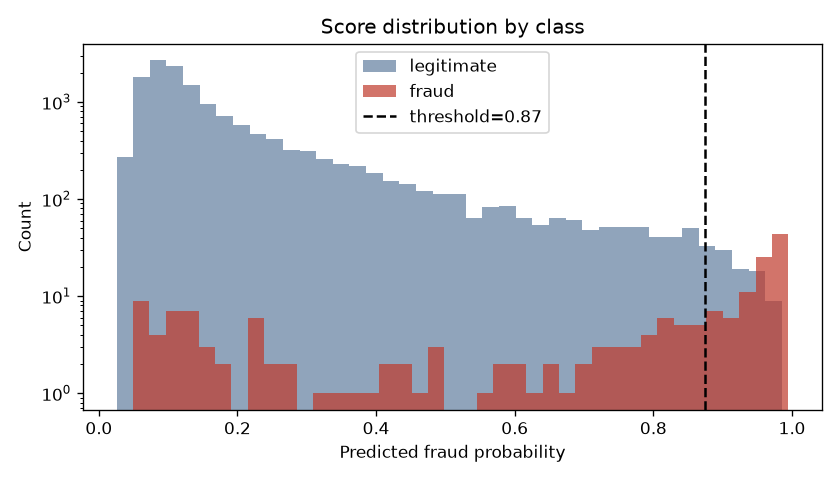
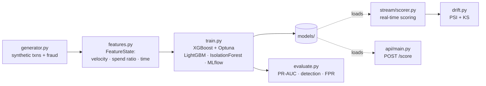

# realtime-fraud-detection

[](https://github.com/bushra-nazeer/realtime-fraud-detection/actions/workflows/ci.yml)


Real-time fraud detection on a streaming transaction feed: a tuned **XGBoost**
classifier and an **IsolationForest** anomaly detector, scored through a
**pluggable Kafka / in-memory** pipeline, with live **PSI + KS drift
monitoring** and a **FastAPI** scoring service.

> **Self-contained:** transactions come from a realistic synthetic generator
> (no external dataset), and the streaming demo runs over an in-memory bus (no
> broker needed). A real Kafka path ships via `docker compose --profile kafka`.
> All metrics below are from a real run and are deliberately *realistic*, not
> suspiciously perfect.

## Results (held-out test set)

| Metric | XGBoost | LightGBM baseline |
|---|---|---|
| **ROC-AUC** | **0.864** | 0.809 |
| PR-AUC | 0.500 | — |
| Detection rate (recall) @ operating point | 0.50 | — |
| Precision @ operating point | 0.50 | — |
| False-positive rate | 0.6% | — |

Fraud is ~1.2% of transactions, and ~15% of it is "stealth" fraud crafted to
look identical to legitimate spend — which honestly caps recall, exactly as it
does in production. The operating threshold targets 50% precision (fraud
alerting trades precision for coverage; it never chases 90%).

| Precision–Recall | Score distribution by class |
|---|---|
|  |  |

## Streaming + drift (live demo)

`make stream-demo` scores a 5,000-event stream whose distribution **shifts
partway through** (more fraud, larger amounts, more foreign activity):

```
events: 5000 | actual fraud: 94 | caught: 49 | false positives: 54
drift events detected: 2   (KS p-value collapses to ~1e-35 once the shift lands)
```

The drift monitor catches the shift via the KS test even before PSI crosses its
threshold — the safety net that tells you a deployed model needs retraining.

## What it demonstrates

- **Streaming architecture** — a `MessageSource` abstraction with real Kafka and
  in-memory backends; identical scoring logic for both.
- **Modeling** — XGBoost (Optuna-tuned) + LightGBM baseline, imbalance-aware,
  reporting the metrics that matter for fraud (detection rate, FPR, PR-AUC).
- **Anomaly detection** — IsolationForest as a complementary unsupervised signal.
- **Drift monitoring** — custom PSI + Kolmogorov–Smirnov detector over the live
  score stream.
- **No train/serve skew** — one `FeatureState` builds features for training, the
  stream, and the API.
- **MLOps** — MLflow tracking, FastAPI service, Docker, CI (ruff + pytest).

## Architecture



## Quickstart

```bash
# Docker — serve the scoring API (model baked in)
docker compose up --build api          # http://localhost:8000

# Local with uv
make install
make train          # XGBoost + Optuna + LightGBM baseline + anomaly model + MLflow
make evaluate       # metrics + PR curve + score-distribution plots
make stream-demo    # in-memory streaming sim with live drift detection (no broker)
make serve          # FastAPI on :8000
make test           # pytest    |    make lint

# Real Kafka path
docker compose --profile kafka up      # starts Redpanda on :9092
```

## Using the API

```bash
curl -s localhost:8000/score -H 'Content-Type: application/json' -d '{
  "customer_id": 4821, "amount": 1299.00, "hour": 3,
  "merchant_category": "online", "is_foreign": 1, "distance_from_home_km": 740
}'
```

```json
{
  "fraud_probability": 0.83,
  "is_flagged": true,
  "risk_band": "High",
  "anomaly_score": 0.61,
  "top_factors": [
    { "feature": "amount_to_cust_mean", "contribution": 1.9 },
    { "feature": "is_foreign", "contribution": 1.1 },
    { "feature": "distance_from_home_km", "contribution": 0.7 }
  ]
}
```

The API keeps per-customer state in-process, so repeated calls build velocity
and spend-ratio context just like the streaming consumer. Schema:
`src/fraud/api/schemas.py`.

## Repository layout

```
src/fraud/   generator · features · dataset · train · evaluate · anomaly · drift · explain
src/fraud/stream/   source (Kafka/in-memory) · scorer (real-time + drift)
src/fraud/api/      FastAPI /score, /health
tests/       generator, features, drift, training, streaming, API
docs/        architecture diagram + design spec
```

## License

[MIT](LICENSE)
