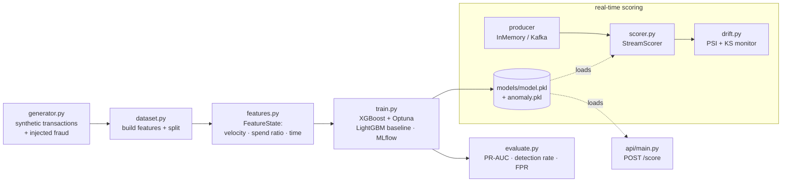

# Architecture

## Pipeline + streaming

## Why the feature state is shared

`FeatureState` (per-customer velocity, spend ratio, recency) is the same object
in three places: building the training matrix (replayed in time order), the
streaming consumer, and the API. One implementation → no train/serve skew.

## Streaming transport

`MessageSource` has two implementations: `InMemorySource` (demo + tests, no
broker) and `KafkaSource` (real, via `docker compose --profile kafka up`). The
scoring logic never changes between them.

## Drift detection

`DriftMonitor` compares a live window of model scores against a reference
distribution using **PSI** (population stability index) and the **KS** test.
The demo stream deliberately shifts its distribution partway through so the
monitor fires, proving the safety net works.

## Modules

| Module | Responsibility |
|---|---|
| `generator.py` | Synthetic transactions with controllable fraud patterns |
| `features.py` | Stateful, leak-free feature engineering (train == serve) |
| `dataset.py` | Deterministic build + split shared by train/evaluate |
| `train.py` | XGBoost + Optuna, LightGBM baseline, IsolationForest, MLflow |
| `evaluate.py` | Detection rate, FPR, PR-AUC, threshold, diagnostic plots |
| `anomaly.py` | IsolationForest unsupervised signal |
| `drift.py` | PSI + KS drift monitor |
| `stream/` | Pluggable source + real-time `StreamScorer` |
| `api/` | FastAPI `/score`, `/health` |
